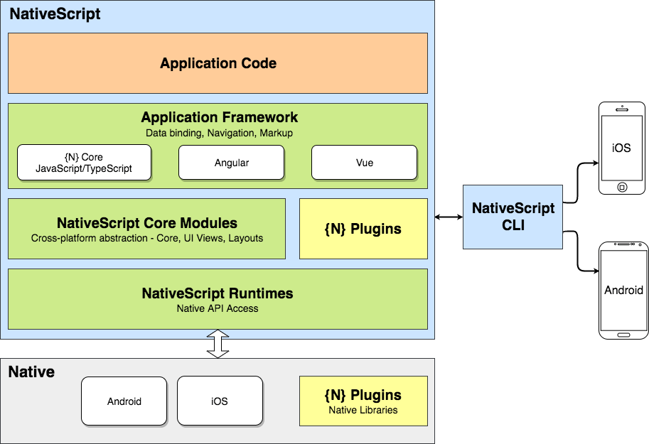

# Nativescript - A case study

In January 2018 we started a new mobile app project. The decision was made to use the quite new Framework [Nativescript](https://www.nativescript.org/). One reason for this decision was that our customer has a lot of experience in Angular development and our team was mainly built of Java and web developers with JavaScript knowledge and lack of mobile development knowledge like Objective-C, Swift or Android. 

During this project we were facing lots of challenges and I'd like to share our practical experience so it might help you in your next technology decision. 

## Don't be naiv
First of all I think it is important to mention that it would be very naiv to think that frameworks like Nativescript would prevent you from needing any knowledge of the underlying platforms. The sooner or later you'll run into problems where you're happy to know what e.g. an *Intent* on Android is or what a *UINavigationController* on iOS is. In our case we had to write a Plugin right from the beginnging and I'd would have been lost without my expericence in iOS development. 

## Intro

For those who don't know yet Nativescript that well, I'll give a short introduction. For more information please visit their [website](https://www.nativescript.org/). 

So as the name already points out, we're really creating native apps with full access to all native functionalities. Basically the JavaScript    code is executed during runtime on the devices, there is no cross-compilation. 

Basically one can choose between plain JavaScript, Angular or VueJS to build your app. The framework provides the core modules which abstracts the basic functionalites of the underlying platforms. 

There is a command-line interface (CLI) that lets you create, build and run the apps.

For our project we decided to use Angular as framework on top. We were all experienced in AngularJS and we're all quite experienced in Java development that's why we'd prefere to use TypeScript.

## Tech stack complexity

As the nativescript architecture already suggests there are a lot of layers on top of the underlying platforms which brings an extra complexity into the game.

Since we're using Angular - we have another comlexity on top. Angular is not as lightweight as one would hope and can get quite complex as well, in addition it is not always clear which functionalites of Angular are really supported by Nativescript. 

To give you an idea of what's happening from the moment where you start building the app until you run it on your phone - you might see how many possible error source appear on this way: 

We're using webpack (which should become the default build-tool, as much as I'm aware) to build the app. 

### error messages 
The error messages can be quite useless 

## The plugin hell

When writing an app you'll reach the point where you're asking yourself how can I implement a certain functionality which is not part of the NativeScript framework, like e.g. scan a QR code with the app, but you might know that there are libraries for Android and iOS that support this functionality. 

### Pre-Builts Plugins

Luckily there are a lot of plugins for NativeScript that have already implemented such functionalites. 

There is a [marketplace](https://market.nativescript.org/) that lists all of the plugins. They've added even a nice feature that gives you hints how well maintained a plugin is.

A plugin often just wraps an Android and iOS library and provides a common interface to it. Which also brings some complexity into the game. How well maintained is the underlying library? So that means if e.g. an iOS library needs to be updated for a new iOS version - how long does it take until the new version is available and how long does it take until the plugin is updated for that version. If you find a bug in the plugin you first have to make sure that it is the plugins fault and not the underlying library. If it is a problem of the underlying library it can take quite some time until the problem is fixed. 

### Writing Plugins
